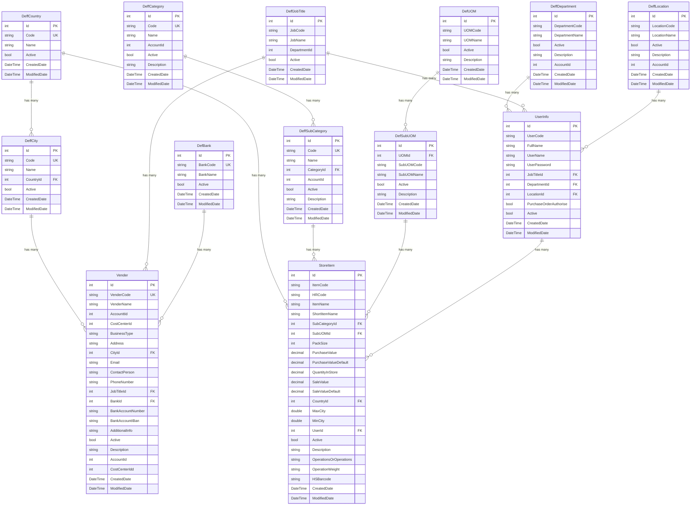

# Database Schema Diagram

## مخطط قاعدة بيانات النظام

## شرح العلاقات (Relationships)

### 1. علاقات الدول والمدن
- **DeffCountry → DeffCity**: دولة واحدة تحتوي على مدن متعددة (1:N)
- **DeffCountry → StoreItem**: دولة واحدة تحتوي على أصناف متعددة (1:N)
- **DeffCity → Vender**: مدينة واحدة تحتوي على موردين متعددين (1:N)

### 2. علاقات التصنيفات
- **DeffCategory → DeffSubCategory**: تصنيف واحد يحتوي على تصنيفات فرعية متعددة (1:N)
- **DeffSubCategory → StoreItem**: تصنيف فرعي واحد يحتوي على أصناف متعددة (1:N)

### 3. علاقات وحدات القياس
- **DefUOM → DefSubUOM**: وحدة قياس واحدة تحتوي على وحدات قياس فرعية متعددة (1:N)
- **DefSubUOM → StoreItem**: وحدة قياس فرعية واحدة تحتوي على أصناف متعددة (1:N)

### 4. علاقات الموظفين
- **DeffDepartment → UserInfo**: قسم واحد يحتوي على موظفين متعددين (1:N)
- **DeffJobTitle → UserInfo**: مسمى وظيفي واحد يحتوي على موظفين متعددين (1:N)
- **DeffJobTitle → Vender**: مسمى وظيفي واحد يحتوي على موردين متعددين (1:N)
- **DeffLocation → UserInfo**: موقع واحد يحتوي على موظفين متعددين (1:N)

### 5. علاقات البنوك
- **DefBank → Vender**: بنك واحد يحتوي على موردين متعددين (1:N)

### 6. علاقات أصناف المخزن
- **UserInfo → StoreItem**: موظف واحد يمكن أن يكون مسؤولاً عن أصناف متعددة (1:N)

## ملاحظات على قاعدة البيانات

### Indexes (الفهارس)
- جميع الأكواد (Codes) لها فهارس فريدة (Unique Indexes)
- فهارس على الحقول الأكثر استخداماً في البحث:
  - `StoreItem.ItemCode`
  - `StoreItem.Active`
  - `DeffSubCategory.CategoryId`
  - `DeffCity.CountryId`

### Delete Behaviors (سلوك الحذف)
- **Restrict**: منع الحذف إذا كانت هناك بيانات مرتبطة
  - `DeffCity → Country`
  - `DeffSubCategory → Category`
  - `DefSubUOM → UOM`

- **SetNull**: تعيين القيمة إلى NULL عند الحذف
  - `StoreItem → SubCategory`
  - `StoreItem → Country`
  - `StoreItem → SubUOM`
  - `Vender → City`
  - `Vender → JobTitle`
  - `Vender → Bank`
  - `UserInfo → JobTitle`
  - `UserInfo → Department`
  - `UserInfo → Location`

## الجداول الرئيسية

### جداول التعريفات (Definition Tables)
1. **DeffCountry** - الدول
2. **DeffCity** - المدن
3. **DeffCategory** - التصنيفات
4. **DeffSubCategory** - التصنيفات الفرعية
5. **DefUOM** - وحدات القياس
6. **DefSubUOM** - وحدات القياس الفرعية
7. **DeffDepartment** - الأقسام
8. **DeffJobTitle** - المسميات الوظيفية
9. **DeffLocation** - المواقع
10. **DefBank** - البنوك

### الجداول الرئيسية (Main Tables)
1. **UserInfo** - بيانات المستخدمين
2. **StoreItem** - أصناف المخزن
3. **Vender** - الموردين

## Database Tables Summary

| Table Name | Arabic Name | Record Count |
|------------|-------------|--------------|
| DeffCountry | الدول | Definition |
| DeffCity | المدن | Definition |
| DeffCategory | التصنيفات | Definition |
| DeffSubCategory | التصنيفات الفرعية | Definition |
| DefUOM | وحدات القياس | Definition |
| DefSubUOM | وحدات القياس الفرعية | Definition |
| DeffDepartment | الأقسام | Definition |
| DeffJobTitle | المسميات الوظيفية | Definition |
| DeffLocation | المواقع | Definition |
| DefBank | البنوك | Definition |
| UserInfo | المستخدمين | Transaction |
| StoreItem | أصناف المخزن | Transaction |
| Vender | الموردين | Transaction |

---

### Legend
- **PK** = Primary Key (المفتاح الأساسي)
- **FK** = Foreign Key (المفتاح الخارجي)
- **UK** = Unique Key (مفتاح فريد)
- **1:N** = One to Many (واحد إلى متعدد)
